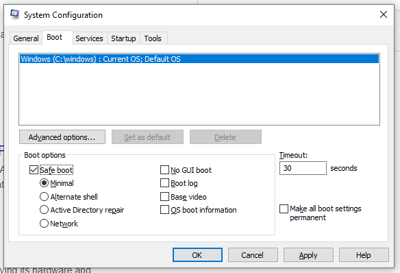
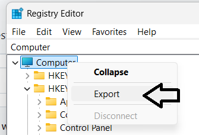

### Switch to Safe Mode
Start (Windows button) + R ---> Run ---> msconfig ---> Boot

Reboot.

### Backup the host's complete Registry 
Start (Windows button) + R ---> Run ---> regedit

Right click 'Computer' and then click 'Export'. Save the registry (e.g. backup.reg).

### Disable csagent service
HKEY_LOCAL_MACHINE\SYSTEM\CurrentControlSet\Services\CSAgent
set START to 4

### Disable Falcon Service
HKLM:\SYSTEM\CurrentControlSet\Services\CSFalconService
set START to 4

### Delete Folder
HKLM:\SYSTEM\CurrentControlSet\Services\CSFalconService

### Delete Folder
HKLM:\SYSTEM\CrowdStrike

### Delete Folder
HKLM:\SYSTEM\CurrentControlSet\Services\CSAgent\Sim

### Delete Folder
HKLM:\SYSTEM\CurrentControlSet\Services\CSAgent

### Reboot Server

### Switch back to Normal Mode from Safe Mode.
Start (Windows button) + R ---> Run ---> msconfig ---> Boot

Uncheck "Safe Boot" and then REBOOT again.

### Uninstall from command prompt (Administrator) with Uninstall Tool (i.e. CsUninstallTool.exe).

### Double-check inside "Add and Remove Programs" and "Services".

### Reboot server again.
